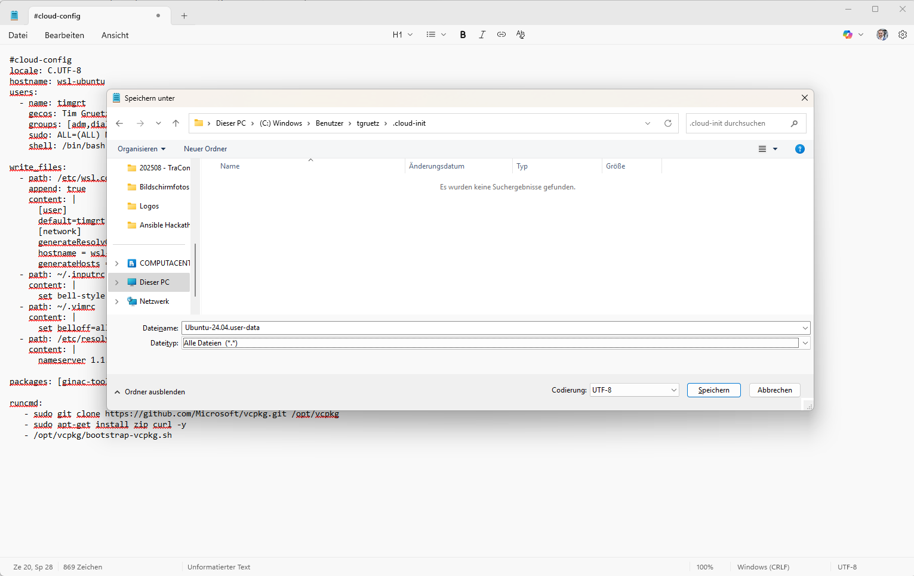

# Prepare WSL

To have a test environment for doing all exercises during the Community Call you can use *Windows Subsystem for Linx (WSL)*.

This guide shows you the basic steps to install **Ubuntu 24.04 LTS** in WSL, configured with *cloud-init*.  

## Create cloud-init configuration

Open the *Editor* App (or Notepad++ or any other editor) and paste in the following content:

```yaml
#cloud-config
locale: C.UTF-8
hostname: wsl-ubuntu
users:
  - name: timgrt
    gecos: Tim Gruetzmacher
    groups: [adm,dialout,cdrom,floppy,sudo,audio,dip,video,plugdev,netdev]
    sudo: ALL=(ALL) NOPASSWD:ALL
    shell: /bin/bash

write_files:
  - path: /etc/wsl.conf
    append: true
    content: |
      [user]
      default=timgrt
      [network]
      generateResolvConf = false
      hostname = wsl-ubuntu
      generateHosts = false
  - path: ~/.inputrc
    content: |
      set bell-style visible
  - path: ~/.vimrc
    content: |
      set belloff=all
  - path: /etc/resolv.conf
    content: |
      nameserver 1.1.1.1
  
packages: [ginac-tools, octave, python3-pip, python3-venv, podman, dbus-user-session]

runcmd:
   - sudo git clone https://github.com/Microsoft/vcpkg.git /opt/vcpkg
   - sudo apt-get install zip curl -y
   - /opt/vcpkg/bootstrap-vcpkg.sh
```

> 🚧 **Update cloud-init configuration** 🚧  
> Adjust your username in line 5 and 6!  
> Adjust line 14 and 30 if you want to change the instance name.

Save the file as `Ubuntu-24.04.user-data` in a new folder `.cloud-init` in your Windows Home directory (e.g. `C:\Users\tgruetz\.cloud-init\Ubuntu-24.04.user-data`). **Do not** save the file as a text file, change the filetype to *All files (*.*)*.



> ⚠️ The cloud-init config file **must** be called `Ubuntu-24.04.user-data` (the same as the distribution name), otherwise it won't be applied!

Take a look at the [Ubuntu on WSL installation with cloud-init documentation](https://documentation.ubuntu.com/wsl/latest/howto/cloud-init/) for further information.

## Install WSL distribution

Run the following command, it will install Ubuntu and configure it according to the cloud-init file:

```console
wsl --install Ubuntu-24.04
```
